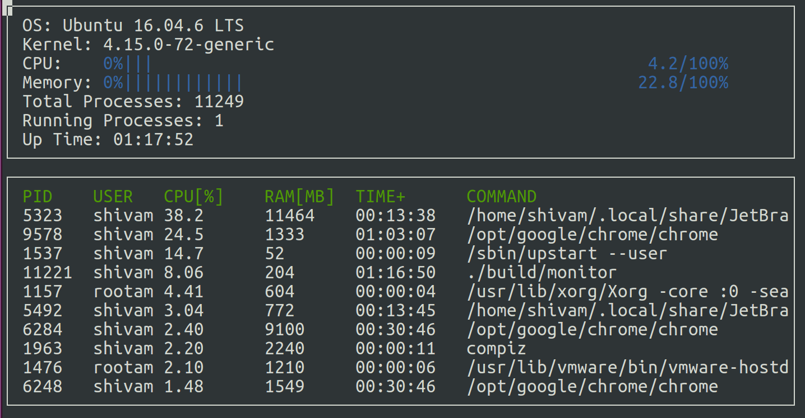

# System Monitor in C++

 

The following project is a part of Udacity’s C++ NanoDegree program. The aim of project is to create an Htop like system monitor.

## ncurses
[ncurses](https://www.gnu.org/software/ncurses/) is a library that facilitates text-based graphical output in the terminal. This project relies on ncurses for display output.

Within the Udacity Workspace, `.student_bashrc` automatically installs ncurses every time you launch the Workspace.

If you are not using the Workspace, install ncurses within your own Linux environment: `sudo apt install libncurses5-dev libncursesw5-dev`

## Make
This project uses [Make](https://www.gnu.org/software/make/). The Makefile has four targets:
* `build` compiles the source code and generates an executable
* `format` applies [ClangFormat](https://clang.llvm.org/docs/ClangFormat.html) to style the source code
* `debug` compiles the source code and generates an executable, including debugging symbols
* `clean` deletes the `build/` directory, including all of the build artifacts

## Instructions

1. Clone the project repository: `git clone https://github.com/udacity/CppND-System-Monitor-Project-Updated.git`
2. Build the project: `make build`
3. Run the resulting executable: `./build/monitor`

The code was tested on the following specifications

- **CPU:** `Intel(R) Core(TM) i9-8950HK CPU @ 4.8 Ghz`
- **GPU:** `Nvidia GeForce GTX 1050 Ti Mobile`
- **RAM:** `32 GB`
- **OS:** `Ubuntu 16.04.6 LTS (Xenial Xerus)` 
- **Kernal:** `4.15.0-72-generic`